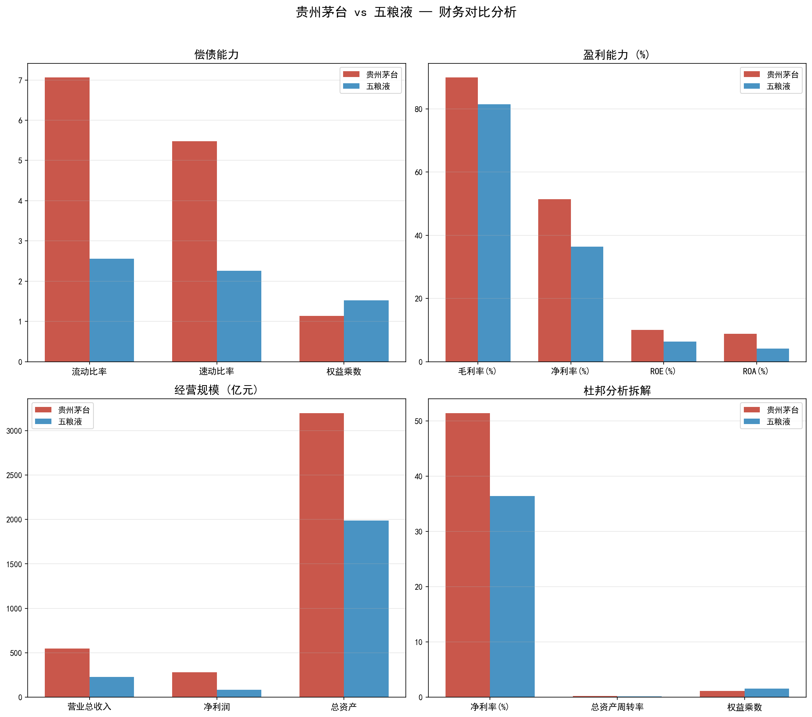
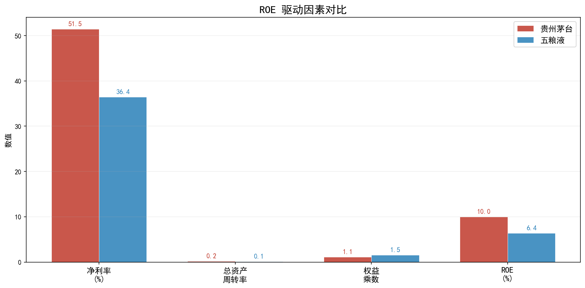

# 白酒行业双龙头财务对比分析

> 贵州茅台 (600519) vs 五粮液 (000858) — 基于 Python 的自动化财务分析

 

## 📊 项目概览

本项目是一个**自动化财务分析工具**，通过 Python 脚本自动获取上市公司财报数据，完成四大维度财务比率计算与杜邦分析体系拆解，并输出可视化图表与 Excel 报告。

对比对象选择了白酒行业最具代表性的两家公司——**贵州茅台**与**五粮液**，分析其盈利模式与财务结构的差异。

## 🔍 核心发现

| 维度 | 贵州茅台 | 五粮液 | 差异要点 |
|------|---------|--------|---------|
| 毛利率 | **89.9%** | 81.4% | 茅台品牌溢价领先 8.5pp |
| 净利率 | **51.5%** | 36.4% | 茅台赚钱效率高出近一半 |
| ROE | **10.0%** | 6.4% | 单季数据，年化约 40%/25% |
| 资产负债率 | **12.1%** | 34.3% | 茅台几乎零负债经营 |
| 净利润 | **281.5亿** | 83.2亿 | 茅台是五粮液的 3.38 倍 |

### 杜邦分析结论

```
茅台 ROE = 51.5%净利率 × 0.17总资产周转 × 1.14权益乘数 = 10.0%
五粮液 ROE = 36.4%净利率 × 0.11总资产周转 × 1.52权益乘数 = 6.4%
```

> **茅台是典型的"高端消费品盈利模式"**——不靠高周转、不靠借债，纯靠定价权和品牌溢价驱动 ROE。

## 📈 分析维度

- **偿债能力**：流动比率、速动比率、资产负债率、权益乘数
- **盈利能力**：毛利率、净利率、ROE、ROA
- **营运能力**：应收账款周转率、存货周转率、总资产周转率
- **发展能力**：营收、净利润规模对比
- **杜邦分析**：ROE 三因子拆解与驱动力判断

## 🛠 技术栈

| 组件 | 用途 |
|------|------|
| `akshare` | 自动获取东方财富 / 新浪财经财务数据 |
| `pandas` / `numpy` | 数据清洗与指标计算 |
| `matplotlib` | 生成对比图表 |
| `openpyxl` | 输出格式化 Excel 报告 |

## 📁 项目结构

```
financial-analysis-project/
├── financial_analysis.py    # 主分析脚本
├── output/
│   ├── 财务对比分析.png      # 四维度对比柱状图
│   ├── 杜邦分析对比.png      # ROE 驱动因素拆解图
│   └── 财务分析报告.xlsx     # 完整 Excel 报告
├── README.md                # 本文件
└── qr_code.png              # 本项目二维码
```

## 🚀 快速运行

```bash
# 1. 安装依赖
pip install akshare pandas numpy matplotlib openpyxl

# 2. 运行分析
python financial_analysis.py

# 3. 查看 output/ 目录下的图表和 Excel 报告
```

## 📸 输出示例

### 财务对比分析


### 杜邦分析拆解


## 👤 作者

- **GitHub**：[xingzhicheng01](https://github.com/xingzhicheng01)
- 财务管理专业 大二在读
- 项目动机：将课堂所学的财务比率与杜邦分析体系应用到真实上市公司数据中，用编程工具实现分析自动化

---

*本项目为课程延伸实践，数据来源为东方财富网与新浪财经公开财务数据。*

---

*本项目为课程延伸实践，数据来源为东方财富网与新浪财经公开财务数据。*
